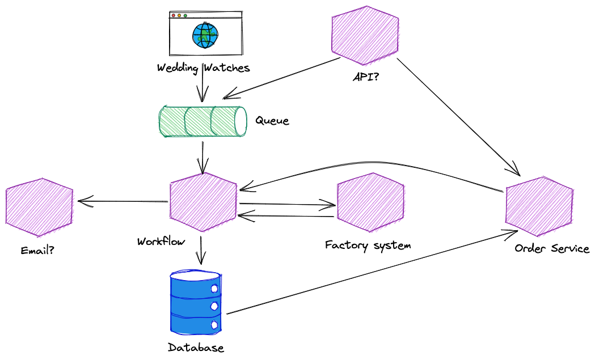

# Folex

The Folex watch company has approached us to deploy their new white-label watch services to the cloud. Folex are currently the fifth largest watchmaker in the world, and they offer watches under a number of different brands as well as custom branding. Their custom branding business allows companies to order customised watches for special occasions, corporate gifts and marketing campaigns that will be customised to their customer's needs.

At the moment, all orders are sent from their brand shops or their customers via email. Most orders will be at least 100 watches so they get sent in with an excel spreadsheet. Then someone has to check each row and instruct the factory to begin production. It is time-consuming and error prone. Last year, over 300 watches were rejected due to mistakes in instructing the factory.

To solve this problem, Folex is going to automate the process. They have developed an automated workflow that will receive orders, validate them and send them to the factory for fabrication.

Our job is to design and build the infrastructure so that we can deploy the services to Google Cloud.

## Technical Summary

Folex has some code that their internal teams have developed for us to deploy and some aspects still need to be designed. They have never worked in the cloud before so they are relying on us to tell them how to design the solution.

The components are as follows:

### Wedding Watches

The Wedding Watches website is another internal brand for Folex. They make sets of watches that are normally given as gifts to members of the wedding party at a wedding. Batches are normally 4-10 watches with bespoke engraving. This application is written in svelte.

### Queue

When orders are received, they should be written to a queue for processing. Folex has provided an API specification for how the data should be structured.

### Workflow

The workflow engine is the heart of the system. It will take orders from the queue, validate them and send them to the factory. When an order is complete or there is a problem, an email will be sent.

This is a Java application and has documentation for how to configure if with environment variables.

### Factory System

The Factory System is our connection to the factories that actually make the watches. The Workflow will send requests to the factory system and wait for messages back. Folex has not really explained how the factory system works, but we understand it connects to an internal ticketing system.

We do not need to do anything other than deploy this service. It is a Java application, and there is documentation in the readme.

### Email

Folex would like to offer email from the Workflow. They would like your advice on how to send emails from an automated system. They need your recommendations on technology, but the Workflow already has some email configuration options so we just need to pick a tool.

### Order Service

The order service is an internal service that provides details of watch orders to the Workflow. It uses a relational database to store data and has a Swagger API definition so we know what it does.

This service is written in Kotlin (which can be built in the same way as Java), and there is a readme.

### Database

Folex is unsure how to manage the database. The Workflow and the Order Service need their own relational database. Folex has said they think any relational database should work. Workflow and the Order service need their own database but Folex is not sure if they should share a server or not.

They need us to recommend a database that we can run in GCP.

### Non-functional requirements

Most of the Folex management team are not technical so they have not given us a long list of requirements, but they had some ideas:

1.	Can we make sure all the services are fault-tolerant and self-healing?
2.	They need an operations dashboard so they can see if there are any errors in the logs.
3.	They want to host everything in GCP, but they don’t know how
4.	They want the websites and API to use HTTPS, but we can host it on our own domain until they have signed off on the project.
5.	They want us to be able to build and deploy the applications in a fully automated way.
6.	Can we try to minimise the running costs?
