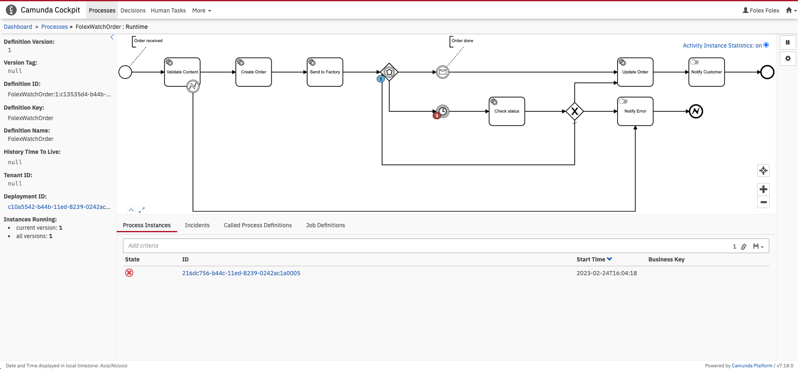

# Folex Workflow

The Folex Workflow manages orders and interacts with the Order and Factory systems. It uses a business process to automate the management of orders and track progress, even if the order errors.

It uses an open-source engine called Camunda.



## Building

To build the service run:

```
mvn clean package
```

## Configuration

The Workflow must be configured with database details. You will need to know the database hostname, the port number, the name of the database, the username and the password.

The configuration values can be set as environment variables using the Spring Boot convention.

It also allows you to set a default username and password so you can access the web application if needed for debugging. When the service is running, open it in the browser, and you will be prompted to log in.

Finally, the workflow requires the URL for the order and factory services.


| Environment Variable            | Value                                                                      |
|---------------------------------|----------------------------------------------------------------------------|
| SPRING_DATASOURCE_URL           | "jdbc:postgresql://${database hostname}:${database port}/${database name}" |
| SPRING_DATASOURCE_USERNAME      | ${database user}                                                           |
| SPRING_DATASOURCE_PASSWORD      | ${database password}                                                       |
| CAMUNDA_BPM_ADMIN_USER_ID       | folex                                                                      |
| CAMUNDA_BPM_ADMIN_USER_PASSWORD | folex                                                                      |
| FOLEX_API_ORDER                 | "${address and port}"                                                      |
| FOLEX_API_FACTORY               | "${address and port}"                                                      |
